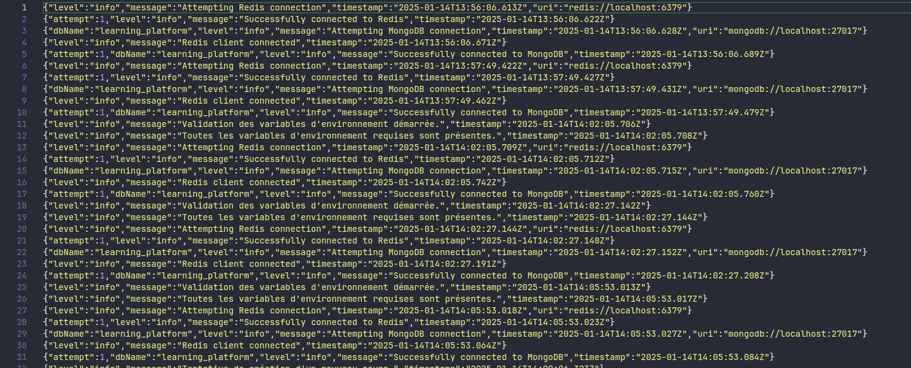
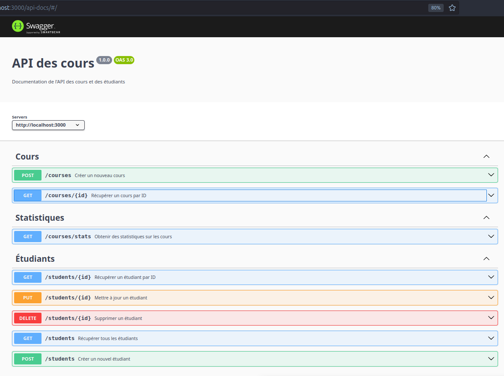

# Backend d'une Plateforme d'Apprentissage en Ligne

Ce projet est une API pour une plateforme d'apprentissage en ligne. Elle fournit des fonctionnalités CRUD pour gérer les étudiants et les cours. Le backend est construit avec Node.js et MongoDB et utilise Redis pour la mise en cache.

---

## Table des matières
- [Installation et Lancement](#installation-et-lancement)
- [Structure du Projet](#structure-du-projet)
- [Choix Techniques](#choix-techniques)
- [Réponses aux Questions](#r%C3%A9ponses-aux-questions)

---

## Installation et Lancement

### Prérequis
- Node.js
- MongoDB
- Redis
- Docker (facultatif pour l'environnement de développement)

### Étapes
1. Clonez le projet :
   ```bash
   git clone https://github.com/ismaildrs/learning-platform-template.git
   cd learning-platform-template
   ```

2. Installez les dépendances :
   ```bash
   npm install
   ```

3. Configurez l'environnement :
   - Copiez le fichier `.env.example` en `.env` et remplissez les valeurs appropriées :
     ```plaintext
      REDIS_URI=redis://localhost:6379
      NODE_ENV=development
      PORT=3000
      MONGODB_DB_NAME=learning_platform
      MONGODB_URI=mongodb://localhost:27017
      LOG_PATH=logs
      LOG_LEVEL=info
     ```
4. Configurez Docker :
   - Assurez-vous que Docker est installé sur votre machine.
   - Positionnez-vous au même niveau que le fichier `docker-compose.yml` et exécutez la commande suivante pour démarrer les services requis :
     ```bash
     docker-compose up -d
     ```
     
5. Lancez le projet :
   ```bash
   npm start
   ```

---

## Structure du Projet

Voici une vue d'ensemble de la structure des fichiers :

```
src/
├── config/
│   ├── db.js               # Configuration de MongoDB et Redis
│   ├── env.js              # Chargement des variables d'environnement
├── controllers/
│   ├── courseController.js # Gestion des cours
│   ├── studentController.js# Gestion des étudiants
├── routes/
│   ├── courseRoutes.js     # Routes pour les cours
│   ├── studentRoutes.js    # Routes pour les étudiants
├── services/
│   ├── mongoService.js     # Intéractions avec MongoDB
│   ├── redisService.js     # Services de cache Redis
├── utils/
│   ├── logger.js           # Logger basé sur Winston
│   ├── swagger.js          # Documentation Swagger
├── app.js                  # Point d'entrée principal de l'application
```

- **config/** : Contient les configurations pour la base de données et les variables d'environnement.
- **controllers/** : Contient la logique métier pour les étudiants et les cours.
- **routes/** : Définit les routes pour les différents endpoints de l'API.
- **services/** : Fournit les abstractions pour MongoDB et Redis.
- **utils/** : Contient des utilitaires comme le logger Winston et la configuration Swagger.

---

## Choix Techniques

### 1. **Logging : Winston**
Winston est utilisé pour une gestion efficace des logs structurés. Il permet de différencier les logs en fonction de leur niveau de gravité. Deux fichiers principaux sont générés :
   - `combined.log` : Contient tous les logs, qu'ils soient informatifs ou d'erreur.
   - `error.log` : Spécifiquement dédié aux erreurs.

**Exemple de structure de log :**
```json
{
  "timestamp": "2025-01-14T10:15:30Z",
  "level": "error",
  "message": "Une erreur est survenue lors de la connexion à MongoDB"
}
```

Voici un aperçu du dossier de logs généré par Winston :



### 2. **Documentation : Swagger**
Swagger est utilisé pour documenter et tester l'API de manière interactive. Grâce à l'interface Swagger UI, il est possible de visualiser et tester chaque endpoint disponible.

Pour accéder à la documentation Swagger, démarrez le projet et ouvrez votre navigateur à l’adresse suivante :
```
http://localhost:3000/api-docs
```

**Capture d'écran de Swagger UI :**  


### 3. **Docker**
Docker est utilisé pour simplifier le déploiement et la gestion des dépendances. Un fichier `docker-compose.yml` est fourni pour lancer facilement les services nécessaires à l'application.

Pour démarrer les services :
```bash
docker-compose up -d
```

---

## Réponses aux Questions

### 1. **Pourquoi utiliser Redis ?**
Redis permet de stocker temporairement des données fréquemment consultées, ce qui réduit la charge sur la base de données MongoDB et améliore les temps de réponse.

### 2. **Comment gérer les erreurs dans l'API ?**
L'API utilise Winston pour logger les erreurs dans un fichier dédié (`error.log`). En cas d'erreur, un message approprié est renvoyé au client avec un code HTTP correct (par exemple, 400 pour une requête invalide, 500 pour une erreur serveur).

### 3. **Mise en place de la gestion des logs**
Le logger Winston est configuré dans le fichier `logger.js` sous le dossier `utils`. Il enregistre les logs dans des fichiers et, en mode développement, affiche également les logs dans la console avec des couleurs.

### 4. **Pourquoi choisir MongoDB ?**
MongoDB est idéal pour ce projet grâce à sa flexibilité dans le stockage des données non structurées et son support natif pour les objets JSON.

